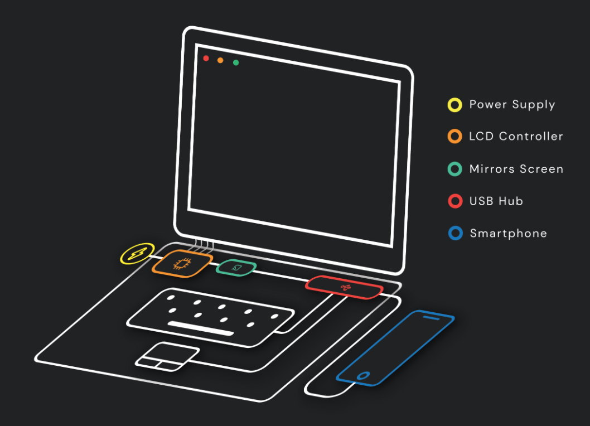
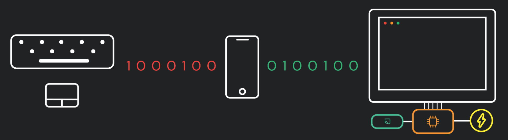

# Jamak

A low cost laptop shell powered by a smartphone to provide a laptop experience for around $70.

View more information at [jamak.cc](http://jamak.cc/).

### Low Cost Laptop Shell

## Electronics

### Design
Below is a simple diagram illustrating the connections between the electronic components.

Below is a diagram illustrating the flow of the data between main components. The data in our design flows from the trackpad and keyboard to the phone to control it via USB-B protocol and from the phone to the LCD screen via Miracast wireless protocol. Using USB-B and Miracast allows us to support multiple phone brands, microUSB, and multiple Android versions.

### Parts
Test Phone:
| Item                              | Cost          | Link                                                                                          |
|-----------------------------------|---------------|-----------------------------------------------------------------------------------------------|
| Xiaomi Redmi 9A                   | $120.29       | https://www.amazon.com/gp/product/B08CH5JY5D/ref=ppx_yo_dt_b_asin_title_o00_s00?ie=UTF8&psc=1 | 

Laptop Parts: 
| Item                              | Cost          | Link                                                                                          |
|-----------------------------------|---------------|-----------------------------------------------------------------------------------------------|
| N116BGE-EA2 Screen                | $44.94        | https://www.amazon.com/gp/product/B00JPJI7B6/ref=ppx_yo_dt_b_asin_title_o00_s01?ie=UTF8&psc=1 |
| LCD Controller Board              | $24.99        | https://www.amazon.com/gp/product/B06XC6SJF7/ref=ppx_yo_dt_b_asin_title_o00_s02?ie=UTF8&psc=1 |
| 12V, 2A Power Supply              | $9.98         | https://www.amazon.com/gp/product/B07HNL5D56/ref=ppx_yo_dt_b_asin_title_o00_s00?ie=UTF8&psc=1 |
| Miracast Microsoft Display        | $42.83        | https://www.amazon.com/gp/product/B01AZC3J3M/ref=ppx_yo_dt_b_asin_title_o00_s00?ie=UTF8&psc=1 |
| iKKEGOL Keyboard                  | $16.99        | https://www.amazon.com/gp/product/B00LL4QQ7U/ref=ppx_yo_dt_b_asin_title_o04_s00?ie=UTF8&psc=1 |
| PS2 to USB                        | $6.99         | https://www.amazon.com/gp/product/B01M0WDUQT/ref=ppx_yo_dt_b_asin_title_o04_s00?ie=UTF8&psc=1 |
| Riboon Cable PCB                  | $5.39         | https://www.amazon.com/gp/product/B07RWRK4WX/ref=ppx_yo_dt_b_asin_title_o02_s00?ie=UTF8&psc   |
| USB Hub                           | $6.48         | https://www.amazon.com/gp/product/B00L2442H0/ref=ppx_yo_dt_b_asin_title_o05_s00?ie=UTF8&psc=1 |
| Trackpad                          | $11.91        | https://www.ebay.com/itm/HP-Pavilion-DV9000-Series-Touchpad-Board-W-Cable-and-Bezel-920-000702-04-/293050263588?pageci=6d339694-2ca5-4785-8b37-22b8872938a7
|Electronics Total                  | $170.50       |

## Physical Casing
| Item                              | Cost          | Link                                                                                          |
|-----------------------------------|---------------|-----------------------------------------------------------------------------------------------|
| 1/16 inch clear acrylic           | $16.85        | https://www.mcmaster.com/catalog/126/3823/                                                    |
| Silver spray paint (if desired)   | x             | anywhere

All schematics for laser cutting the acrylic can be found in the jamak-parts.rld file above.
